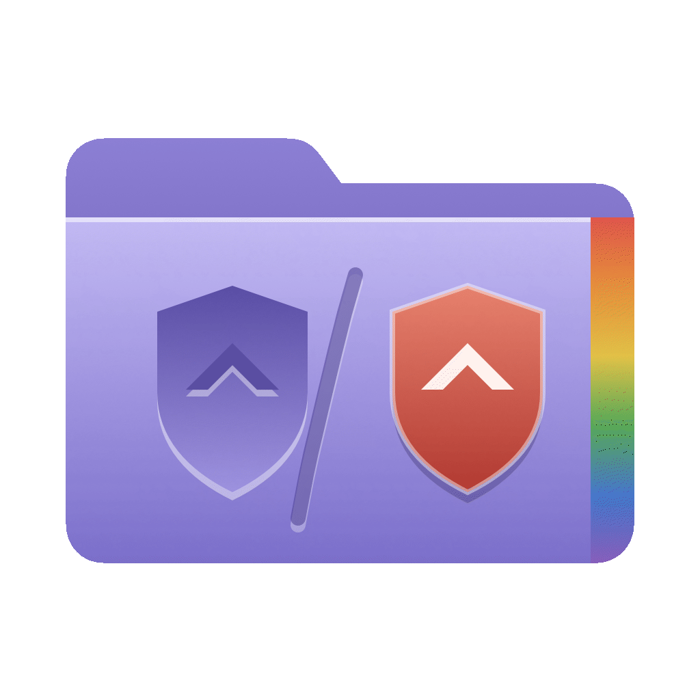

<div align="center">



# Folder Crest

A native macOS app that puts a crest on your folders: text, emoji, an SF Symbol or any image, engraved into the macOS folder icon or placed on top in its own colors - with an optional tint for the whole folder.


</div>

---

<div align="center">

<a href="https://github.com/detlefs/Folder-Crest/blob/19335a56019bfe77933c669a8279e7b25b607a86/LICENSE" target="_blank"></a>&nbsp;
<a href="https://github.com/detlefs/Folder-Crest/releases/latest"></a>&nbsp;
&nbsp;
<a href="https://github.com/detlefs/Folder-Crest/actions/workflows/build.yml"></a>&nbsp;
&nbsp;
&nbsp;


</div>

---

## Get started

💾 [Download latest Folder Crest release](https://github.com/detlefs/Folder-Crest/releases/latest)

💾 [Download the latest SF Symbols tool](https://developer.apple.com/sf-symbols/) (optional)

💾 [Download the SF Pro font(s)](https://developer.apple.com/fonts/) (optional)

---

## Features & Usage

- Drag content onto the main area or the text field to add a symbol:
  - **Text** - up to 25 characters. Change font weight in the inspector.
  - **Emoji** - typed or pasted into the text field, drawn in full color. *Note:* When the text mixes emoji and letters, only the emoji are rendered. *Note 2:* You can use **ctrl**+**cmd**+**space** or **fn**+**e** to open the emoji panel.
  - **SF Symbols** - drag a symbol straight out of the [SF Symbols](https://developer.apple.com/sf-symbols/) app, if it is installed. Monochrome symbols are engraved, multicolor symbols keep their colors. *Note:* You can drop a symbol to the text field as well. In that case it's rendered as text (monochrome, engraved) and can also be combined with normal letters.
  - **Images** - drop an image file or image data from any app. For example, drag an image from your browser to Folder Crest directly. Images with transparency work best.
  - From the Icon inspector
    - arrange the size, horizontal or vertical offset.
    - change the text weight (applies only to text, not to graphics).
    - select the Engraved or Original Colors rendering (applies to graphics only, not text).
- Modify folder color from the Folder Color inspector. Pick one of the pre-defined colors or use the rainbow button to open the macOS color picker.
- Apply the icon
  - **New folder** - creates an "untitled folder" with the icon in a location of your choice.
  - **Existing folder** - drop a folder onto the preview to make it the target. Click **Apply to Folder** to apply it.
  - every icon is written in all sizes macOS uses (16 to 1024 px), so the icon stays sharp in list and column view too.
- **Reset All** returns to the system default plain folder.
- Library
  - Save the current icon with **+** or **⌘S**.
  - Saved icons appear in the sidebar with a thumbnail. Click one to load it back into the editor, rename it by double-click or context menu. Remove it with **−**.
  - The library stores the recipe, not the image, so icons can be re-rendered at any time.
- App
  - Light, dark or automatic appearance, selectable from the toolbar.
  - Localized in English and German (for now).

---

## Limitations

- **System folder color** - Folder Crest writes each icon as a finished image. If you later change the system folder color (System Settings → Appearance → Folder color), folders modified by Folder Crest keep their color. Folder Crest itself picks up the new color as its default after a restart or after Reset All.

## Requirements

- macOS 26 Tahoe or later on Apple silicon (arm64 only, no Intel build).
- Xcode 26.5 to build from source.
- Optional: the [SF Symbols](https://developer.apple.com/sf-symbols/) app. It may also be necessary to install SF Pro font system wide - a freshly installed SF Symbols app will tell you so. Download the fonts from [Apple Fonts](https://developer.apple.com/fonts/).

---

## Building

Open `Folder Crest.xcodeproj` in Xcode and run the **Folder Crest** scheme, or
from the command line:

```bash
xcodebuild -project "Folder Crest.xcodeproj" -scheme "Folder Crest" \
  -destination 'platform=macOS' build
```

Run the tests with `test` instead of `build`. The UI tests drive the real mouse
and keyboard, so the Mac is not usable while they run; add
`-skip-testing:"Folder CrestUITests"` to run only the unit tests.

---

## How it works

Folder Crest is written in Swift and SwiftUI. Icons are rendered on the CPU
from the system's folder graphic using Core Graphics, Core Text and vImage; the
library is kept in SwiftData. The app has no third-party dependencies.

## About this project

Folder Crest was built with the help of AI: large parts of the code, the tests
and the documentation were written together with
[Claude Code](https://claude.com/claude-code).

## Contributing

Pull requests are welcome - bug fixes, new features and translations alike. For larger changes, please open an issue first to discuss the idea.

1. Fork the repository and create a branch from `master`.
2. Make your changes and run the tests (see [Building](#building)).
3. Commit with a short, descriptive message and open a pull request against `master`, describing what you changed and why.

### Localization

All user-facing text lives in a single String Catalog, `Folder Crest/Localizable.xcstrings`. To add a language:

1. Open `Folder Crest.xcodeproj` in Xcode, select the project, go to **Info → Localizations** and add the language with **+**.
2. Open `Localizable.xcstrings`, select the new language and translate every entry. Mark entries as reviewed once they are done.
3. Build and run the app with the new language and check that no text is cut off. In Xcode, set **Product → Scheme → Edit Scheme → Run → Options → App Language**, or from the command line (replace `fr` with the language code):

   ```bash
   xcodebuild -project "Folder Crest.xcodeproj" -scheme "Folder Crest" \
     -destination 'platform=macOS' -derivedDataPath build build
   open -n "build/Build/Products/Debug/Folder Crest.app" --args -AppleLanguages "(fr)"
   ```
4. Add the language to the list under **Features & Usage** and open a pull request.

## License

Released under the [MIT License](LICENSE).